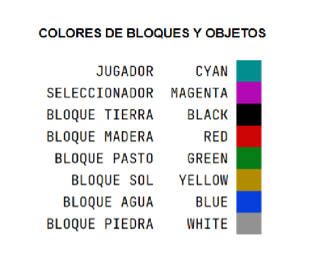

# Minecraft_2D_XYZ

)

## Description

////////////////////////////////////////////////////////////////////////////////////////////////////////////////////////////////

**Spanish version:**

"Minecraft 2D" es un videojuego de mundo abierto. El mundo se centra en la colocacion y destruccion de bloques, siendo que este se compone de objetos bidimensionales cuadrados, colocados sobre un patron de rejilla fija. Estos cuadrados o bloques representan principalmente distintos objetos de la naturaleza tales como tierra, piedra, hierro, tronco , arena, entre otros. Basado en el esencia original del juego original se propone disenar e implementar un programa en consola sencillo de manejar y que sea divertido. Cuando el usuario escriba "init" para comenzar el juego en modo creativo para luego mostrar el mundo xyz.

Cada celda del mundo xyz es pintado por un color que representa al jugador, seleccionador, bloque de tierra, bloque de madera, bloque de pasto, bloque de sol, bloque de agua y bloque de piedra. Ademas cabe mencionar que el jugador se encuentra en una posicion P J(x, y) y el seleccionador en una posicion PS(x, y); el jugador con el seleccionador acorde a su posicion sobre el mundo, activa el modo recolectar si el seleccionador esta sobre un bloque de madera
o piedra, y en caso de otro tipo de bloque se activa el modo destruir. Luego se cuenta la cantidad de bloques recolectados de madera y piedra. El jugar puede ingresar una operacion que puede la combinaci ́on de top, down, right o left para desplazar y tambien con destroy y collect para realizar una accion; el jugador se puede desplazar sobre todo el mundo menos en los bloques de tierra y fuera de los limites del mundo de 30x20. En caso de moverse a esa
posicion mostrar un mensaje ”invalid operation”.

Este proyecto ocupo unicamente la libreria de colorama, apto para ser el primer proyecto para programadores juniors.

////////////////////////////////////////////////////////////////////////////////////////////////////////////////////////////////

**English version:**

"Minecraft 2D" is an open world videogame. The world focuses on placing and destroying blocks, as the world is made up of square bidimensional objects, placed on a fixed grid pattern. These squares or blocks mainly represent different objects of nature such as dirt, stone, iron, trunk, sand and others. Based on the original essence of the original game, its proposed to design and implement a console program that is easy to handle and fun. When the user types "init" to start the game in creative mode to then show the xyz world.

Each cell in the xyz world is painted by a color that represents the player, selector, dirt block, wood block, grass block, sun block, water block, iron block and stone block. It is also worth mentioning that the player is in a position P J(x, y) and the selector is in a position PS(x, y); the player with the selector according to his position on the world, activates the collect mode if the selector is on a block of wood
or stone, and in case of another type of block, destroy mode is activated. Then the number of blocks collected from wood and stone is counted. The player can enter an operation that can the combination of top, down, right or left to move and also with destroy and collect to perform an action; the player can move around the world except on the land blocks and outside the limits of the 30x20 world. In case of moving to that position display an “invalid operation” message.

This project only occupied the colorama library, apt to be the first project for junior programmers.

## HOW TO PLAY

Dentro del videojuego encontraras una lista de comandos, para iniciar el juego tendras que digitar **init**, si deseas salir **exit**. Luego de ello, el comando **help** te facilitara que comandos estan disponibles tales como **top**, **down**, **right** , **left**, **extract** o **destroy**. Es un juego sencillo de comprender y divertido para pasar el rato en tiempos de corto plazo.

Inside the game you'll find a list of commands, to start the game you will have to type **init**, if you want to exit **exit**. After that, the **help** command will tell you which commands are available such as **top**, **down**, **right**, **left**, **extract** or * *destroy**. It is a simple game to understand and fun to pass the time in short-term times.

[add img references]

## COLOURS TABLE

## REQUERIMENTS

-  colorama== 0.4.4

